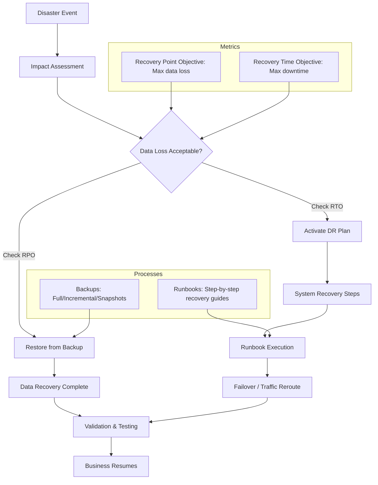

Let’s break down **Disaster Recovery (DR)** with focus on **backups, RPO/RTO, and runbooks**:

---

## 🔹 What is Disaster Recovery (DR)?

Disaster Recovery is the set of policies, tools, and procedures that enable recovery of IT systems, data, and operations after disruptive events (e.g., hardware failure, cyberattack, natural disaster).

It ensures **business continuity** by reducing downtime and data loss.

---

## 🔹 Core Concepts

### 1. **Backups**

* **Definition**: Copies of data stored separately (onsite/offsite/cloud) for restoration.
* **Types**:

  * Full backup (all data each time).
  * Incremental backup (only changed data since last backup).
  * Differential backup (changes since last full backup).
  * Snapshot (point-in-time copy).
* **Best practices**:

  * Follow the **3-2-1 rule**: 3 copies, 2 media types, 1 offsite.
  * Encrypt sensitive backups.
  * Automate + test restores regularly.

---

### 2. **RPO (Recovery Point Objective)**

* **Definition**: The maximum acceptable amount of **data loss** measured in time.
* Example: RPO = 15 minutes → must restore to a state no older than 15 minutes before failure.
* **Implication**: Determines **backup frequency** or replication strategy.

  * Small RPO → needs **real-time replication**.
  * Large RPO → periodic backups may suffice.

---

### 3. **RTO (Recovery Time Objective)**

* **Definition**: The maximum acceptable **downtime** after an outage before services must be restored.
* Example: RTO = 1 hour → systems must be back online within 1 hour.
* **Implication**: Drives **infrastructure design**:

  * Low RTO → hot standby, high availability clusters.
  * High RTO → cold backups, manual restore is acceptable.

---

### 4. **Runbooks**

* **Definition**: Step-by-step documented procedures for recovering systems and applications after a disaster.
* **Contents**:

  * Contact list (teams, vendors, escalation).
  * System inventory (applications, dependencies, priorities).
  * DR steps (restore from backup, failover process, DNS switch, etc.).
  * Validation/Testing checklist.
* **Types**:

  * **Manual runbooks** – human executed.
  * **Automated runbooks** – scripts & orchestration (e.g., Ansible, Terraform, Cloud DR automation).

---

## 🔹 Example Scenario

A company runs an e-commerce site:

* **RPO = 5 minutes** → Database must replicate every 5 minutes (e.g., streaming replication).
* **RTO = 30 minutes** → Site must be live within 30 minutes (using failover to secondary region).
* **Backups**: Nightly full + 15-min incremental database backups.
* **Runbook**:

  1. Detect outage.
  2. Notify DR team.
  3. Failover to standby DB + reroute traffic via DNS.
  4. Validate transactions.
  5. Confirm systems operational.

---

## 🔹 Summary Table

| Concept      | Purpose                   | Key Metric/Goal                |
| ------------ | ------------------------- | ------------------------------ |
| **Backups**  | Protect & restore data    | Availability of recent copies  |
| **RPO**      | Limit data loss           | “How much data can we lose?”   |
| **RTO**      | Limit downtime            | “How quickly must we recover?” |
| **Runbooks** | Document recovery process | Reliable, repeatable recovery  |

---

Here’s a **mermaid diagram** you can put into your `README.md` to visualize how **Backups, RPO, RTO, and Runbooks** connect in a Disaster Recovery workflow:

This shows:

* **Backups** tie into **RPO** (data loss).
* **Runbooks** tie into **RTO** (downtime).
* Both converge to enable **Business Continuity** after a disaster.

