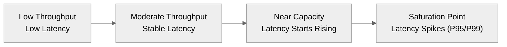

**latency and throughput** and specifically the **percentiles (P50, P95, P99)** that are commonly reported in performance testing. Here’s a clear, structured explanation:

---

## 🔹 1. Latency

Latency measures **how long it takes to process a single request**.

* **Unit:** Usually measured in milliseconds (ms).
* **Goal:** Lower latency is better.
* **Percentiles (P50/P95/P99):**

  * **P50 (Median Latency):** 50% of requests are faster than this value, 50% are slower.
  * **P95:** 95% of requests are faster than this value. This highlights performance for most users.
  * **P99:** 99% of requests are faster than this value. This shows *tail latency* — worst-case performance experienced by a small % of users.

> **Example:**
> If P50 = 100ms, P95 = 300ms, P99 = 1s, it means:
>
> * Most requests finish in \~100ms
> * 5% take longer than 300ms
> * 1% take up to 1s (these are the "slow outliers").

---

## 🔹 2. Throughput

Throughput measures **how many requests your system can handle in a given time period**.

* **Unit:** Requests per second (RPS) or Transactions per second (TPS).
* **Goal:** Higher throughput is better.
* **Often measured together with latency** — because higher throughput usually increases latency once the system approaches saturation.

---

## 🔹 3. Why P50/P95/P99 Are Used

* **P50** shows typical user experience.
* **P95** shows experience for "almost all" users.
* **P99** reveals *rare performance problems* that may affect power users, APIs, or SLAs.

Most modern systems (APIs, databases, distributed systems) **monitor P95/P99** because:

* Outliers matter — they can cause timeouts, cascading failures, or bad UX.
* Averages (mean) can hide bad tail latency.

---

## 🔹 4. Visualization

Here’s a simple mental model:

```
Latency Distribution
|----|---------|-------------|--------------------|--------------|
P50  P75      P90          P95                 P99
```

* P50 = Median (center)
* P95/P99 = Tail end (longer response times)

<div align="center">
  
</div>


> **Explanation:**
> This diagram illustrates how latency is distributed across requests. Most requests complete near the P50 (median), representing typical user experience. P95 and P99 capture the “tail latency,” where requests are significantly slower — often due to system contention, retries, or resource spikes. Monitoring these higher percentiles is critical for ensuring consistent performance and avoiding user-visible slowdowns.

Here’s a more **technical, engineering-focused version** you can use:

Here’s a **technical version with a real-world example** added — great for blogs, documentation, or slides:

> **Explanation:**
> This diagram shows latency distribution across percentiles. While **P50 (median)** represents the typical user experience, **P95** and **P99** expose the “long tail” of slow requests that can degrade overall reliability. Engineering teams often track these higher percentiles as part of **SLAs/SLOs**, since tail latency affects critical workflows, increases retry storms, and can trigger cascading failures in distributed systems.
>
> **Example:**
> Consider an API with an SLO of **P99 < 500 ms**. This means 99% of requests must complete under 500 ms — even under peak load. If P50 is 120 ms but P99 spikes to 2 s during traffic bursts, users may experience timeouts and backpressure, even though the median latency seems healthy. Optimizing for **P95/P99** ensures consistent, predictable response times and a smoother end-user experience.


**classic visualization** that shows the relationship between **latency** and **throughput** — often called the **"latency vs throughput curve"** or **"saturation curve."**

Here’s how you can visualize it:

---

## 📊 Concept

* As **throughput (requests/sec)** increases, **latency** stays low initially.
* Once the system nears **capacity**, latency starts to rise sharply (queue buildup, contention).
* P95/P99 grow much faster than P50 near saturation.

---

## 📈 Visualization Idea

Here’s a **Mermaid plot-like conceptual diagram** (works in docs):



But since Mermaid can’t do real charts, a **proper chart** would look like this:

```
Latency (ms)
│                   P99   ───────╮
│                          ╭─────╯
│                 P95  ────╯
│        P50 ─────╯
│
└─────────────────────────────────────▶ Throughput (RPS)
         Low         Moderate         High
```

**Key Takeaways from Chart:**

* **P50 stays flat** until near saturation.
* **P95/P99 shoot up** dramatically as throughput approaches max capacity.
* This is why SLOs usually target P95/P99 — to avoid unacceptable tail latency under load.

---
