Here’s a **clear, structured overview of Load Balancing**, covering L4 vs L7, algorithms like Round Robin, Least Connections, and Consistent Hashing:

---

## **1. What is Load Balancing?**

Load balancing is the process of distributing incoming network traffic across multiple servers to:

* Prevent overloading a single server
* Improve performance & reliability
* Scale applications horizontally

Load balancers act as a **traffic manager**, deciding which backend server should handle each request.

---

## **2. Layer 4 (L4) vs. Layer 7 (L7) Load Balancing**

| Aspect                        | **Layer 4 (Transport)**                                      | **Layer 7 (Application)**                                               |
| ----------------------------- | ------------------------------------------------------------ | ----------------------------------------------------------------------- |
| **OSI Layer**                 | Layer 4 (TCP/UDP)                                            | Layer 7 (HTTP/HTTPS, gRPC)                                              |
| **Routing Decision Based On** | IP address + TCP/UDP port                                    | HTTP headers, cookies, path, hostnames, content                         |
| **Protocol Awareness**        | No awareness of application data                             | Full understanding of application-level data                            |
| **Performance**               | Faster (no deep packet inspection)                           | Slightly slower (parses request content)                                |
| **Use Case**                  | Simple TCP/UDP load balancing (e.g., database, game servers) | Web apps needing intelligent routing (A/B testing, routing by URL path) |

---

## **3. Common Load Balancing Algorithms**

### **a) Round Robin (RR)**

* **How it works:** Assigns requests to servers in a fixed order (Server 1 → Server 2 → … → Server N → repeat).
* **Pros:** Simple, fair when servers are identical.
* **Cons:** Doesn’t account for server load differences.

**Example:**
If you have 3 servers and 6 incoming requests → they are distributed as `S1, S2, S3, S1, S2, S3`.

---

### **b) Least Connections**

* **How it works:** Sends traffic to the server with the fewest active connections.
* **Pros:** Dynamically balances load based on current utilization.
* **Cons:** Slightly more overhead (tracks connection counts).

**Best For:** Long-lived connections (e.g., WebSockets, video streaming).

---

### **c) Weighted Round Robin / Weighted Least Connections**

* **Weighted RR:** Some servers get a higher share of requests (useful if servers have different capacities).
* **Weighted LC:** Takes both active connections and server weights into account.

---

### **d) Consistent Hashing**

* **How it works:** Uses a hash of a client identifier (e.g., IP, user ID) to consistently route the same client to the same server.
* **Pros:** Good for session persistence (stickiness).
* **Cons:** If servers are added/removed, many keys may remap unless a proper consistent hashing ring is used.

**Use Case:** Caching systems, session-based apps where state must stay on the same node.

---

## **4. Example Architecture**

**Typical Flow:**
`Client → DNS → Load Balancer (L4 or L7) → Algorithm (RR/LC/Hash) → Target Server`

---

```mermaid
flowchart TD
    A["🌐 Client Request"] --> B["⚖️ Load Balancer"]

    %% L4 vs L7 Split
    B -->|TCP/UDP Based| C["🔄 L4 Load Balancing"]
    B -->|HTTP/HTTPS Based| D["🧠 L7 Load Balancing"]

    %% L4 Decisions
    C --> C1["🔁 Round Robin"]
    C --> C2["📉 Least Connections"]
    C --> C3["⚖️ Weighted RR / LC"]
    C --> C4["🔑 Consistent Hashing"]

    %% L7 Decisions
    D --> D1["🌍 Route by Hostname"]
    D --> D2["📂 Route by Path / Headers"]
    D --> D3["🧲 Sticky Sessions"]
    D --> D4["🧪 A/B Testing"]

    %% Backend Servers
    C1 --> E["🖥 Server Pool"]
    C2 --> E
    C3 --> E
    C4 --> E
    D1 --> E
    D2 --> E
    D3 --> E
    D4 --> E

    %% Styling Section
    style A fill:#FEF3C7,stroke:#D97706,stroke-width:2px
    style B fill:#E0E7FF,stroke:#4338CA,stroke-width:2px
    style C fill:#DCFCE7,stroke:#16A34A,stroke-width:2px
    style D fill:#DBEAFE,stroke:#2563EB,stroke-width:2px
    style E fill:#F3F4F6,stroke:#374151,stroke-width:2px
```

Absolutely — a **real-life example** makes load balancing much easier to understand.

Let’s break it down step by step with a **real scenario**:

---

## 🌐 **Real-Life Example: E-Commerce Website**

Imagine you run an online store like **Amazon**.
You have **millions of users**, and you can’t rely on a single server — it would crash under the load.

### **1️⃣ Layer 4 (L4) Load Balancing Example**

* **Scenario:**
  Your database cluster has multiple replicas.
  You use an **L4 load balancer** to distribute **TCP connections** for read queries.

* **Algorithm Used:**
  **Least Connections** – users streaming product reviews or keeping shopping carts open are spread evenly so no single database replica gets overloaded.

* **Why L4?**
  Because you don’t need to look inside the data — just route at the network level.
  It’s fast and efficient.

---

### **2️⃣ Layer 7 (L7) Load Balancing Example**

* **Scenario:**
  Your web frontend is made of several microservices:

  * `/products` → Product Service
  * `/cart` → Cart Service
  * `/checkout` → Payment Service

* **Algorithm Used:**
  **Round Robin** for `/products` (stateless requests)
  **Sticky Sessions** for `/cart` (to keep user’s session on the same server)
  **A/B Testing** routes 10% of `/checkout` traffic to a new payment gateway.

* **Why L7?**
  Because you need to **inspect the URL path** and make smart routing decisions.

---

### **3️⃣ Consistent Hashing Example**

* **Scenario:**
  You have a **distributed cache** (e.g., Redis cluster) for product data.
  You use **consistent hashing** so that:

  * Product ID `12345` always maps to the same cache node.
  * When you add or remove nodes, most of the keys **stay in place**, minimizing cache misses.

---

### 🖼 Putting It Together

**Flow for a Single User Request:**

1. User opens `https://store.com/products/shoes`.
2. **DNS** points them to your global load balancer.
3. **L7 load balancer** inspects the path `/products` and sends the request to one of the **product microservice servers** (using RR).
4. That microservice queries the **database cluster**, where an **L4 load balancer** distributes read requests to replicas (Least Connections).
5. The response is cached via **consistent hashing** so future users get faster results.

```mermaid
flowchart TD
    %% Client
    A["🌐 User Browser - Requests /products/shoes"] --> B["🌍 DNS - (Global Anycast)"]
    B --> C["⚖️ L7 Load Balancer - (HTTP/HTTPS)"]

    %% L7 Decisions
    C -->|Path: /products| D1["🛍 Product Service - 🔁 Round Robin"]
    C -->|Path: /cart| D2["🛒 Cart Service - 🧲 Sticky Sessions"]
    C -->|Path: /checkout| D3["💳 Payment Service - 🧪 A/B Testing"]

    %% Product Service calls DB
    D1 --> E["🔄 L4 Load Balancer - (TCP/UDP)"]
    E -->|Least Connections| F["🗄 DB Replica 1"]
    E -->|Least Connections| G["🗄 DB Replica 2"]
    E -->|Least Connections| H["🗄 DB Replica 3"]

    %% Cache Layer
    D1 --> I["🧠 Distributed Cache - 🔑 Consistent Hashing"]
    I --> J["🗂 Cache Node A"]
    I --> K["🗂 Cache Node B"]
    I --> L["🗂 Cache Node C"]

    %% Styling
    style A fill:#FEF3C7,stroke:#D97706,stroke-width:2px
    style C fill:#DBEAFE,stroke:#2563EB,stroke-width:2px
    style D1 fill:#DCFCE7,stroke:#16A34A,stroke-width:2px
    style D2 fill:#DCFCE7,stroke:#16A34A,stroke-width:2px
    style D3 fill:#DCFCE7,stroke:#16A34A,stroke-width:2px
    style E fill:#E0E7FF,stroke:#4338CA,stroke-width:2px
    style F fill:#F3F4F6,stroke:#374151,stroke-width:2px
    style G fill:#F3F4F6,stroke:#374151,stroke-width:2px
    style H fill:#F3F4F6,stroke:#374151,stroke-width:2px
    style I fill:#FAE8FF,stroke:#9333EA,stroke-width:2px
    style J fill:#F3F4F6,stroke:#6B21A8,stroke-width:1px
    style K fill:#F3F4F6,stroke:#6B21A8,stroke-width:1px

```

