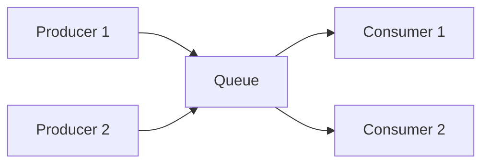
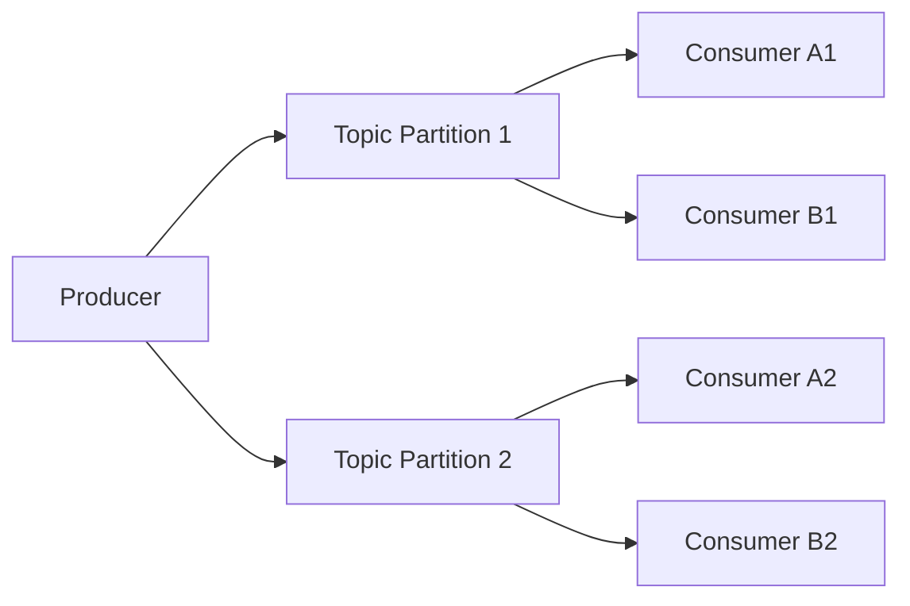

**overview of Queues & Streams** (like Kafka, RabbitMQ, etc.) in a structured way.
Here’s a concise but complete explanation:

---

# 📌 Queues & Streams (Kafka, RabbitMQ, etc.)

## 1. **Core Concepts**

| Aspect             | Message Queues (e.g., RabbitMQ)                                        | Streams (e.g., Kafka)                                                          |
| ------------------ | ---------------------------------------------------------------------- | ------------------------------------------------------------------------------ |
| **Purpose**        | Reliable, ordered delivery of messages between producers and consumers | Continuous, durable event log for real-time processing and replay              |
| **Delivery Model** | Point-to-Point (1 consumer per message)                                | Publish-Subscribe (multiple consumers can read the same message independently) |
| **Data Retention** | Message deleted once consumed (unless explicitly re-queued)            | Retained for a configurable time (or until disk full), can re-read old events  |
| **Ordering**       | Usually per-queue ordering guaranteed                                  | Per-partition ordering guaranteed                                              |
| **Scalability**    | Scales with number of queues and consumers                             | Scales with number of partitions and brokers                                   |
| **Use Case**       | Work distribution, task queue, async processing                        | Event sourcing, real-time analytics, log aggregation                           |

---

## 2. **Architecture Overview**

### **Message Queue (RabbitMQ Example)**

🔑 **Key Idea:** A message is consumed by **only one worker**, ensuring load balancing.

---

### **Stream Processing (Kafka Example)**

🔑 **Key Idea:** Consumers in the **same group** share partitions (parallelism),
while **different groups** can read the same data independently (fan-out).

---

## 3. **Real-Life Examples**

| Scenario                                                                          | Solution                                                                             |
| --------------------------------------------------------------------------------- | ------------------------------------------------------------------------------------ |
| **E-commerce Order Processing** – Orders come in, workers pick them up to process | **RabbitMQ** (guarantees each order is processed once by a single worker)            |
| **User Activity Tracking** – Track clicks, searches, page views for analytics     | **Kafka** (stores stream for replay, allows multiple teams to consume the same data) |
| **Email/SMS Sending** – Background task that retries on failure                   | RabbitMQ / SQS                                                                       |
| **Fraud Detection** – Process payment events in near-real-time                    | Kafka + stream processors                                                            |

---

## 4. Quick Rule of Thumb

Use a Queue when:

✅ Each message should be handled by exactly one worker

✅ You want to balance work between workers

✅ You don’t care about re-reading old data

Use a Stream when:

✅ You want multiple systems to consume the same event

✅ You may need to replay events later

✅ You are building analytics, monitoring, or ML pipelines

---
