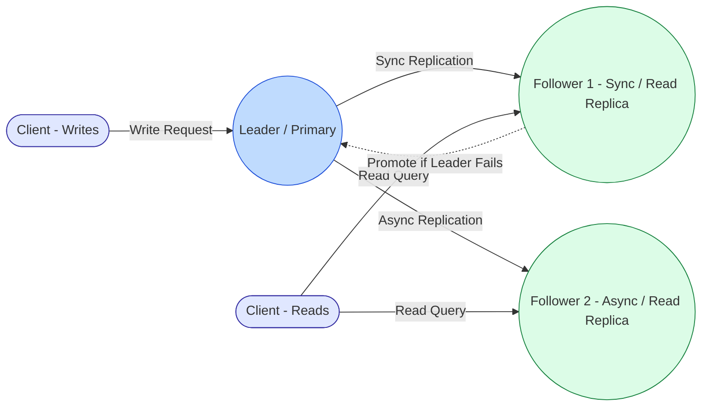

Here’s a detailed breakdown of **replication** in distributed systems and databases, covering **sync/async replication, leader/follower setup, and read replicas**:

---

## 1. **Replication Overview**

Replication is the process of copying data from one node (server) to another to ensure **high availability, fault tolerance, and scalability**.

Key goals:

* **Durability**: Ensures data isn’t lost if one node fails.
* **Availability**: Multiple nodes can serve requests.
* **Scalability**: Read and sometimes write traffic can be distributed.

---

## 2. **Sync vs Async Replication**

| Feature         | **Synchronous (Sync)**                                                                                    | **Asynchronous (Async)**                                                                                         |
| --------------- | --------------------------------------------------------------------------------------------------------- | ---------------------------------------------------------------------------------------------------------------- |
| **Definition**  | Writes are applied to primary and replicas **at the same time**, before confirming success to the client. | Writes are applied to primary **first**, then sent to replicas; client is confirmed before replicas are updated. |
| **Consistency** | Strong consistency (all nodes see the same data)                                                          | Eventual consistency (replicas may lag behind)                                                                   |
| **Latency**     | Higher write latency (must wait for replicas)                                                             | Low write latency (primary responds immediately)                                                                 |
| **Use Case**    | Critical data requiring strong consistency (e.g., financial transactions)                                 | High-throughput apps where slight delay is acceptable (e.g., analytics, logging)                                 |

---

## 3. **Leader/Follower Replication**

Also called **Primary/Replica** or **Master/Slave**.

### **How it works**:

* **Leader (Primary)**: Receives all write requests.
* **Follower (Replica)**: Copies data from the leader.
* **Read traffic**: Often served from followers to reduce load on leader.
* **Failover**: If leader fails, a follower can be promoted to leader.

### **Diagram**:

```
       Write
Leader --------> Follower1
   |             Follower2
   |             Follower3
   |
   v
 Read Requests
```

---

## 4. **Read Replicas**

* Read replicas are **followers specifically optimized for read queries**.
* Common in **high-read, low-write workloads**.
* Writes still go to the leader; reads can be load-balanced across replicas.

### **Benefits**

* Reduces load on primary node.
* Improves read scalability and performance.
* Can be geographically distributed to reduce latency for users.

### **Caveats**

* With async replication, reads may be slightly stale (eventual consistency).
* More replicas → more replication lag to monitor.

---

## 5. **Real-Life Examples**

| System         | Replication Type             | Notes                                                   |
| -------------- | ---------------------------- | ------------------------------------------------------- |
| **MySQL**      | Leader/Follower + async      | Supports read replicas for scaling read-heavy workloads |
| **PostgreSQL** | Leader/Follower + sync/async | Can do synchronous replication for critical tables      |
| **MongoDB**    | Replica Sets                 | Primary/Secondary with automatic failover               |
| **Kafka**      | Leader/Partition Replicas    | Supports sync replication for durability                |
| **Redis**      | Master/Replica               | Async replication; supports read replicas               |

---

### **Summary Table**

| Concept           | Key Point                               |
| ----------------- | --------------------------------------- |
| Sync Replication  | Strong consistency, higher latency      |
| Async Replication | Lower latency, eventual consistency     |
| Leader/Follower   | Single write point, multiple read nodes |
| Read Replicas     | Optimize reads, may be slightly stale   |

---

🖼️ Updated Conceptual View



## Difference between - **Follower 1** and **Read Replica 1**

**Follower 1** and **Read Replica 1** are **not two separate databases** — in most real systems, **Follower 1 *is* the Read Replica**.

Here’s the relationship:

---

### 🔑 **Follower vs Read Replica**

| Role                              | Purpose                                                                | Behavior                                                                                       |
| --------------------------------- | ---------------------------------------------------------------------- | ---------------------------------------------------------------------------------------------- |
| **Follower (Replication Target)** | Receives data changes from the Leader (via sync or async replication). | Keeps a full copy of the data, stays in sync with Leader.                                      |
| **Read Replica**                  | A Follower that is *exposed to clients* for read queries.              | Same data as Follower (may be slightly stale if async). Used to offload read load from Leader. |

So **Follower 1 → Read Replica 1** is basically:

* Follower 1 is *keeping data in sync with Leader*
* We *enable it* to serve reads, and that’s when we call it a Read Replica

---

### 📌 In Practice:

* **Every Read Replica is a Follower**, but not every Follower must be a Read Replica.
* You can have a Follower that is **hidden** (just for HA failover) and not serving reads.
* You can also have multiple Read Replicas in different regions to reduce latency.

---


