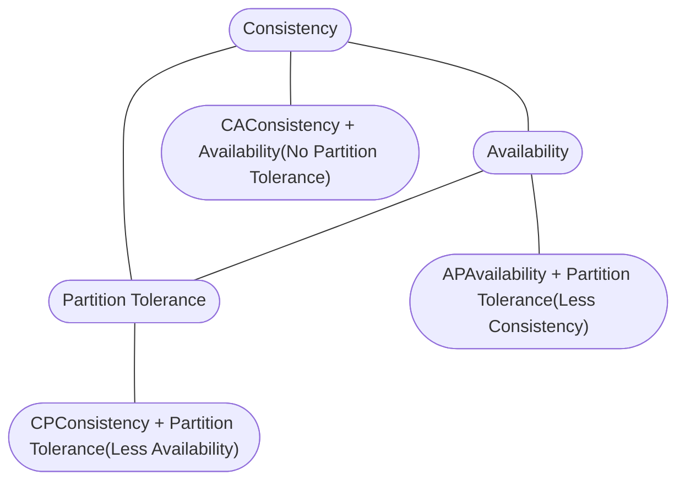

The **CAP Theorem** (also known as Brewer’s Theorem) is a fundamental concept in distributed systems that describes the trade-offs between three key properties:

---

### **C – Consistency**

Every read receives the **most recent write** (or an error).
In other words, all nodes see the same data at the same time.

---

### **A – Availability**

Every request (read or write) receives a **non-error response**, regardless of the state of the nodes — but it might not be the most recent data.

---

### **P – Partition Tolerance**

The system continues to function **even if there is a network partition**, meaning nodes can’t communicate with each other.

---

### **The Theorem**

CAP states that in the presence of a **network partition**, a distributed system can provide **only two out of the three** guarantees:

| Choice                                      | What It Means                                                                                                                                                         | Example Systems                                                 |
| ------------------------------------------- | --------------------------------------------------------------------------------------------------------------------------------------------------------------------- | --------------------------------------------------------------- |
| **CP** (Consistency + Partition tolerance)  | Prioritizes **consistency** over availability. During partition, some requests may fail (not available) but data stays consistent.                                    | HBase, MongoDB (when configured with write concerns), Zookeeper |
| **AP** (Availability + Partition tolerance) | Prioritizes **availability** over consistency. During partition, nodes may return stale data but remain available.                                                    | Cassandra, DynamoDB, Couchbase                                  |
| **CA** (Consistency + Availability)         | Prioritizes both consistency and availability, but **cannot tolerate network partitions** — usually applies to single-node systems or systems in a single datacenter. | Traditional relational databases (before sharding/replication)  |

---

### **Key Insight**

* In **real-world distributed systems**, **P (partition tolerance)** is non-negotiable (network failures happen).
* So you typically choose **between C and A**:

  * **CP systems** sacrifice availability during partitions.
  * **AP systems** sacrifice strict consistency during partitions.

---

