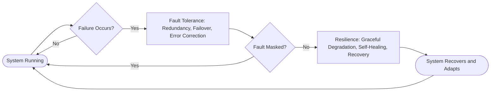

Got it — you want an explanation of **Fault Tolerance** and **Resilience** (likely in the context of systems, software, or architecture).

Here’s a clear breakdown:

---

## 🖥️ **Fault Tolerance**

**Definition:**
Fault tolerance is the ability of a system to continue operating **correctly** even when some of its components fail.
The focus is on **masking failures** so that users or other systems don’t notice a problem.

**Key Characteristics:**

* **Redundancy:** Extra components (servers, storage, network links) take over when one fails.
* **Failover mechanisms:** Automatic switch to backup systems when failure is detected.
* **Error detection & correction:** Mechanisms like parity checks, RAID, and checksums.
* **Goal:** **No interruption** to service.

**Examples:**

* RAID 5/6 storage arrays that keep working even if a disk fails.
* Kubernetes automatically rescheduling pods to healthy nodes.
* Airplane control systems with redundant computers running in parallel.

---

## 🔄 **Resilience**

**Definition:**
Resilience is the system’s ability to **recover and return to a normal operating state** after a failure, degradation, or unexpected event.
It doesn’t necessarily prevent downtime but **minimizes impact and speeds recovery**.

**Key Characteristics:**

* **Graceful degradation:** Service quality reduces gradually, not abruptly.
* **Self-healing:** Systems automatically recover (restart crashed processes, re-balance load).
* **Adaptability:** The system learns from failure and adjusts to prevent recurrence.
* **Goal:** **Rapid recovery** and maintaining acceptable service levels.

**Examples:**

* Circuit Breaker pattern in microservices — failing fast and retrying after cooldown.
* Chaos Engineering (Netflix’s Chaos Monkey) to test system recovery.
* Auto-scaling in cloud services to handle sudden traffic spikes.

---

## ⚖️ **Fault Tolerance vs Resilience** (Side-by-Side)

| Aspect       | Fault Tolerance                      | Resilience                                        |
| ------------ | ------------------------------------ | ------------------------------------------------- |
| **Focus**    | Avoiding failure impact              | Recovering from failure                           |
| **Approach** | Redundancy, failover, masking faults | Graceful degradation, self-healing                |
| **Downtime** | Ideally **zero**                     | May have **short downtime** but recovers quickly  |
| **Example**  | RAID, high availability clusters     | Circuit breakers, auto-restart, chaos engineering |
| **Goal**     | Continuous availability              | Fast recovery and adaptation                      |

---

Here’s a **left-to-right Mermaid diagram** that visually shows how **Fault Tolerance** and **Resilience** work in a system workflow:

---

### 🖼️ **How to Read This**

* **Fault Tolerance** acts first — tries to keep the system running **without disruption**.
* If it **cannot completely mask the failure**, **Resilience** takes over — recovers, adapts, and restores normal operation.
* Together, they form a feedback loop that improves overall **availability and reliability**.
