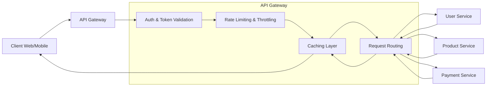

Got it — you want to know about **API Gateway**. Here’s a clear, structured explanation:

---

## 🔑 What is an API Gateway?

An **API Gateway** is a server that acts as a **single entry point** for all client requests to your backend services.
Instead of clients talking to multiple microservices directly, they send requests to the gateway, which then forwards (or transforms) them to the appropriate service.

Think of it like a **front desk at a hotel** — guests talk to the front desk, and the desk coordinates with housekeeping, room service, or maintenance behind the scenes.

---

## 🛠️ Key Responsibilities

1. **Request Routing**

   * Directs incoming API calls to the correct microservice.
   * Hides service endpoints from clients.

2. **Load Balancing**

   * Distributes requests evenly among multiple service instances.

3. **Authentication & Authorization**

   * Validates API keys, JWT tokens, OAuth tokens, etc.
   * Ensures only authorized clients can access protected resources.

4. **Rate Limiting & Throttling**

   * Controls how many requests a client can send (protects services from overload).

5. **Caching**

   * Stores common responses to reduce latency and load on backend.

6. **Transformation**

   * Converts data formats (e.g., XML ⇆ JSON).
   * Aggregates responses from multiple services into one.

7. **Monitoring & Logging**

   * Tracks API usage, response times, errors.

---

## 📌 Real-Life Example

Imagine an **e-commerce app** with:

* Product service
* Cart service
* Payment service
* User service

Without a gateway, your mobile app must call all these services directly → more complexity, more network calls.
With an API Gateway:

* The app makes **one call** to `/checkout`
* The gateway calls:

  * `GET /cart` from Cart Service
  * `GET /user` from User Service
  * `POST /charge` to Payment Service
* Then combines the results into a single response.

---

## 🖼️ Simple Architecture

```
[ Client (Web/Mobile) ]
          |
          v
   [ API Gateway ]
   /     |      \
  v      v       v
User   Product   Payment
Svc     Svc       Svc
```

---

## 🌎 Popular API Gateways

* **AWS API Gateway** (fully managed)
* **Kong Gateway**
* **NGINX** (when configured as a reverse proxy)
* **Apigee** (Google)
* **Traefik**
* **Zuul** (Netflix)

---



🔎 What’s included:

Auth failure → returns 401 Unauthorized to client.

Rate limit exceeded → returns 429 Too Many Requests.

Caching → cache hit returns immediately, cache miss continues to services.

Service failures → errors from User/Product/Payment service are returned to the client.

Successful paths → aggregated responses returned to client.

✅ This diagram renders correctly in GitHub Markdown, Mermaid Live Editor, and VS Code Mermaid preview.
