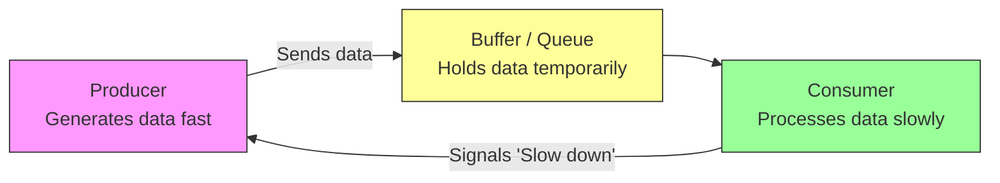

“Backpressure” is a concept mostly used in **software systems, networking, and stream processing**. It happens when the **rate of incoming data exceeds the system’s ability to process it**, and some mechanism is needed to prevent overload, data loss, or crashes.

Let me break it down clearly:

---

### **1. Definition**

Backpressure is the mechanism by which a system **signals to a producer to slow down the rate of data production** when the consumer or downstream system cannot keep up.

---

### **2. Why it’s important**

Without backpressure:

* Buffers can overflow → data loss
* Systems can crash due to resource exhaustion
* Latency can increase dramatically

With backpressure:

* Flow of data is regulated
* System remains stable
* Resources are used efficiently

---

### **3. Examples**

#### **Networking**

* A TCP connection has built-in backpressure.
* If the receiver’s buffer is full, it tells the sender to stop or slow down sending more packets.

#### **Message Queues / Streaming**

* Kafka, RabbitMQ, or Flink allow backpressure.
* Example: A consumer processes messages slower than the producer produces them.

  * The system may slow down message ingestion or temporarily store messages until the consumer catches up.

#### **Reactive Programming**

* Frameworks like **RxJava**, **Project Reactor**, or **Akka Streams** implement backpressure.
* Example: A `Flowable` emits items at a high rate, but the subscriber requests only a few items at a time.

  * The publisher waits until the subscriber is ready for more.

---

### **4. How it works**

There are a few common strategies:

1. **Buffering** – Store data temporarily until the consumer can process it.
2. **Dropping** – Discard data that can’t be processed (less safe).
3. **Throttling / Rate Limiting** – Reduce the production rate.
4. **Signaling / Feedback** – Let the producer know exactly how much it can send.

---

### **5. Real-life analogy**

Imagine a coffee shop:

* Barista can make **10 coffees per minute**.
* Customers come in at **20 per minute**.
* Backpressure is like a **line forming at the counter** or a **sign telling new customers to wait**, preventing chaos.

---

✅ How it works:

Producer sends data to Buffer.

Consumer processes data slower than producer generates it.

When the Buffer fills up, Consumer sends a backpressure signal to Producer to slow down.

This prevents overflow and keeps the system stable.
