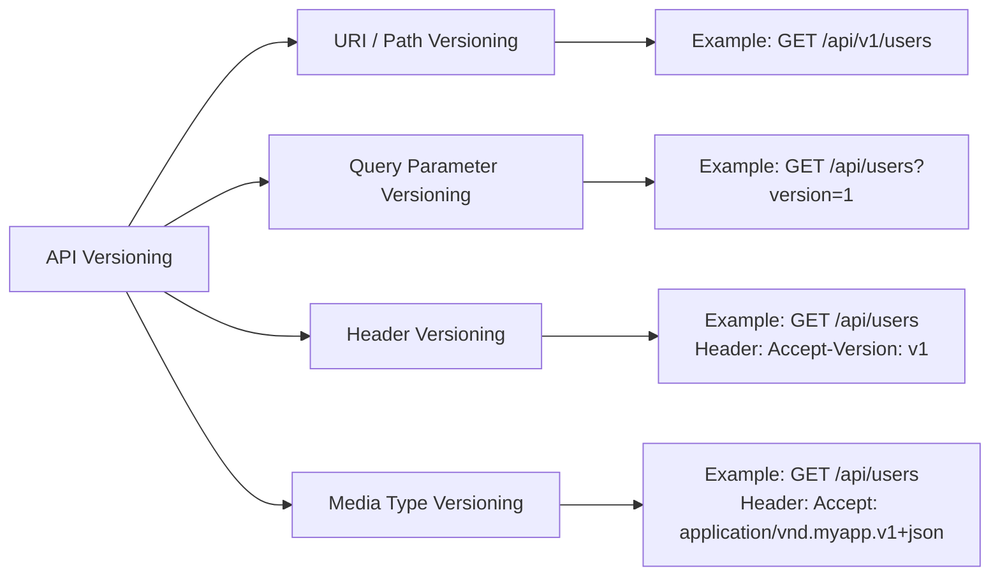

API versioning is a strategy used to manage changes in an API while ensuring that existing clients continue to work without breaking. When an API evolves over time (adding new features, fixing bugs, changing data formats), clients that rely on older behaviors may break. Versioning helps handle this gracefully.

Here’s a detailed breakdown:

---

### **1. Why API Versioning is Important**

* **Backward Compatibility:** Older clients should continue to function.
* **Smooth Upgrades:** Clients can adopt new versions at their own pace.
* **Clear Communication:** Versions indicate changes in behavior, structure, or features.
* **Minimizes Breaking Changes:** Avoids sudden disruptions to consumers.

---

### **2. Common API Versioning Strategies**

#### **A. URI Versioning (Path Versioning)**

The version is part of the URL.

```
GET /api/v1/users
GET /api/v2/users
```

**Pros:**

* Simple and explicit.
* Easy to test via browsers and tools like Postman.

**Cons:**

* Clutters URLs.
* Can violate REST purism (URL should identify resource, not version).

---

#### **B. Query Parameter Versioning**

Version is specified as a query parameter.

```
GET /api/users?version=1
GET /api/users?version=2
```

**Pros:**

* Easy to implement.
* Flexible for dynamic versioning.

**Cons:**

* Can be overlooked.
* Not as discoverable as URI versioning.

---

#### **C. Header Versioning (Custom Header)**

Version is passed in HTTP headers.

```
GET /api/users
Header: Accept-Version: v1
Header: Accept-Version: v2
```

**Pros:**

* Clean URLs.
* Can handle complex version negotiation.

**Cons:**

* Harder to test directly in a browser.
* Clients need to set headers explicitly.

---

#### **D. Media Type Versioning (Content Negotiation)**

Version is part of the MIME type in the `Accept` header.

```
GET /api/users
Header: Accept: application/vnd.myapp.v1+json
Header: Accept: application/vnd.myapp.v2+json
```

**Pros:**

* Powerful and flexible.
* Allows multiple content formats per version.

**Cons:**

* More complex to implement.
* Less intuitive for simple APIs.

---

### **3. Versioning Best Practices**

1. **Start without versioning if possible:** Only introduce it when breaking changes are needed.
2. **Keep versions for a limited time:** Deprecate old versions and communicate timelines.
3. **Document versions clearly:** Provide changelogs and migration guides.
4. **Avoid versioning every minor change:** Only for breaking or substantial changes.
5. **Prefer semantic versioning (optional):** `v1.0`, `v1.1`, `v2.0` for finer control.

---

### **4. Example**

**URI versioning:**

```http
GET /api/v1/products
Response:
[
  { "id": 1, "name": "Laptop", "price": 1000 }
]

GET /api/v2/products
Response:
[
  { "id": 1, "name": "Laptop", "price": 1000, "currency": "USD" }
]
```

* `v1` doesn’t include currency, `v2` does. Clients can migrate when ready.

---


