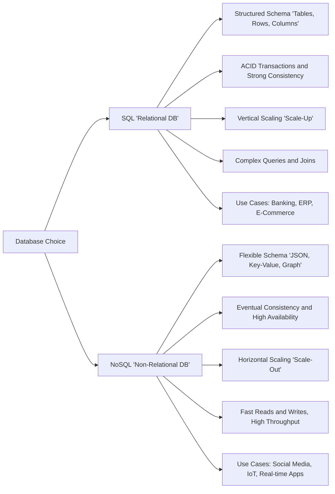

Choosing between **SQL** and **NoSQL** databases depends on your application's requirements, data structure, and scalability needs. Here's a detailed comparison to help you decide:

---

## **1. Data Model**

| Feature       | SQL (Relational)                         | NoSQL (Non-relational)                            |
| ------------- | ---------------------------------------- | ------------------------------------------------- |
| Structure     | Tables with rows and columns             | Document, key-value, graph, or column-family      |
| Schema        | Fixed schema; changes require migration  | Flexible or dynamic schema; easy to evolve        |
| Relationships | Supports JOINs and complex relationships | Limited or no JOINs; relationships often embedded |

---

## **2. Query Language**

| Feature    | SQL                                                  | NoSQL                                                                            |
| ---------- | ---------------------------------------------------- | -------------------------------------------------------------------------------- |
| Query      | Structured Query Language (SQL)                      | Varies: MongoDB uses JSON-like queries, Cassandra uses CQL, Redis commands, etc. |
| Complexity | Supports complex queries, aggregations, transactions | Queries may be simpler; aggregation often application-side or via framework      |

---

## **3. Scalability**

| Feature                | SQL                                               | NoSQL                                         |
| ---------------------- | ------------------------------------------------- | --------------------------------------------- |
| Vertical vs Horizontal | Mostly vertical scaling (scale-up: bigger server) | Horizontal scaling (scale-out: add servers)   |
| Large Data Sets        | Can handle large data but may need sharding       | Designed for distributed systems and big data |

---

## **4. Consistency & Transactions**

| Feature             | SQL                                                                    | NoSQL                                                                                       |
| ------------------- | ---------------------------------------------------------------------- | ------------------------------------------------------------------------------------------- |
| ACID                | Strong ACID compliance (Atomicity, Consistency, Isolation, Durability) | Often eventual consistency; some (MongoDB, Cassandra) support ACID at document or row level |
| Transaction Support | Multi-row transactions                                                 | Usually limited or single-document/row                                                      |

---

## **5. Use Cases**

**SQL is ideal for:**

* Structured data with clear schema
* Applications requiring transactions (banking, e-commerce)
* Reporting and analytics with complex queries

**NoSQL is ideal for:**

* Unstructured or semi-structured data (JSON, XML)
* High-volume, low-latency applications (social media, IoT)
* Rapid development with evolving schema

---

## **6. Popular Examples**

* **SQL**: MySQL, PostgreSQL, Oracle, Microsoft SQL Server
* **NoSQL**: MongoDB (document), Redis (key-value), Cassandra (wide-column), Neo4j (graph)

---

### **Quick Decision Guide**

* **Need complex queries & strong consistency?** → SQL
* **High scalability & flexible schema?** → NoSQL
* **Hybrid approach?** → Use both (Polyglot persistence)

---

