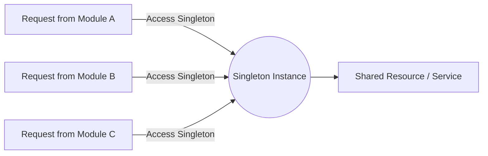
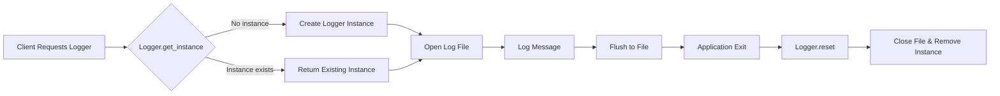

Got it — let’s break down **Singleton** in a clear, practical way from a **system design** and **software systems** perspective.

---

## **1. What is a Singleton?**

A **Singleton** is a **design pattern** that ensures **only one instance** of a particular class (or component) exists in the entire system and provides a **global point of access** to that instance.

Think of it as a "single, shared object" that everyone uses, instead of creating multiple copies.

---

## **2. Why Use Singleton in System Design?**

In **system design** and **software architecture**, you use Singleton when:

* You need **exactly one instance** of something shared across the system.
* Creating multiple instances could cause **conflicts, inefficiency, or inconsistency**.
* You want a **centralized control point**.

---

## **3. Real-World Analogy**

* **Government Passport Office** – There’s one central authority that issues passports.
  If there were multiple independent passport offices with their own rules, you’d get chaos.
  Instead, there’s a **single point of truth** (like a Singleton).

---

## **4. Practical Software Examples**

| **Use Case**                 | **Why Singleton?**                                                                                                                    |
| ---------------------------- | ------------------------------------------------------------------------------------------------------------------------------------- |
| **Logging Service**          | You don’t want multiple loggers writing in different formats or locations. A single logger ensures consistent logging across the app. |
| **Configuration Manager**    | Stores system-wide config (database connection strings, feature flags). You don’t want multiple conflicting configurations.           |
| **Cache Manager**            | A single in-memory cache for fast data retrieval avoids redundant data copies and sync issues.                                        |
| **Thread Pool**              | Creating multiple pools wastes memory and CPU. A single, shared pool is efficient.                                                    |
| **Database Connection Pool** | Controls access to a limited set of connections — must be managed centrally.                                                          |

---

## **5. How It Works (Conceptually)**



**Explanation:**

* All modules (A, B, C) use the same instance (`S`).
* The Singleton manages a shared resource (`R`).
* Guarantees consistency and centralized control.

---

## **6. Pros and Cons**

✅ **Advantages**

* Single source of truth
* Saves memory (no duplicate objects)
* Centralized control

⚠️ **Disadvantages**

* Can become a **global state** → makes testing harder
* Can be a **bottleneck** if not thread-safe
* Overuse leads to tightly coupled design

---
##  Implementation in Python


---
```python
import threading

class Logger:
    _instance = None
    _lock = threading.Lock()  # To ensure thread-safety

    def __new__(cls, log_file="app.log"):
        with cls._lock:
            if cls._instance is None:
                cls._instance = super().__new__(cls)
                cls._instance._initialized = False
            return cls._instance

    def __init__(self, log_file="app.log"):
        # Prevent reinitialization
        if getattr(self, '_initialized', False):
            return
        self.log_file = log_file
        self._open_file()
        self._initialized = True

    def _open_file(self):
        self.file = open(self.log_file, "a")

    def log(self, message):
        self.file.write(f"[Logger id: {id(self)}] {message}\n")
        self.file.flush()

    @classmethod
    def get_instance(cls, log_file="app.log"):
        return cls(log_file)

    @classmethod
    def reset(cls):
        with cls._lock:
            if cls._instance:
                cls._instance.file.close()
                cls._instance = None

# Example Usage
def thread_logging(name):
    logger = Logger.get_instance()
    logger.log(f"Thread {name} logging...")
    print(f"Thread {name}: Logger id {id(logger)}")

if __name__ == "__main__":
    logger1 = Logger.get_instance()
    logger1.log("Starting application...")

    logger2 = Logger.get_instance()
    logger2.log("Another log message...")

    print(f"logger1 is logger2: {logger1 is logger2}")  # True → Both are same logger instance

    # Demonstrate thread safety
    threads = []
    for i in range(3):
        t = threading.Thread(target=thread_logging, args=(f"T{i+1}",))
        threads.append(t)
        t.start()
    for t in threads:
        t.join()
    Logger.reset()  # Clean up the logger before exit

```
```bash

[Logger id: 2903481907344] Starting application...
[Logger id: 2903481907344] Another log message...
[Logger id: 2903481907344] Thread T1 logging...
[Logger id: 2903481907344] Thread T2 logging...
[Logger id: 2903481907344] Thread T3 logging...
```
