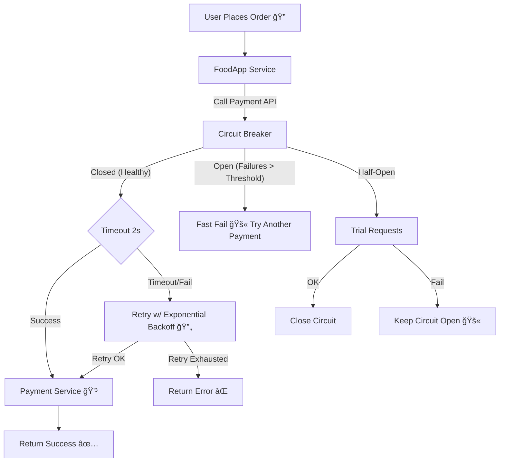

Let’s break these three patterns down — they’re all **resilience patterns** used in distributed systems, microservices, and APIs to handle **failures, delays, or overloads** gracefully.

---

## 1. **Circuit Breakers**

* **What it is:** Inspired by electrical circuit breakers.

  * Prevents a failing service from being called repeatedly, which could waste resources and cause cascading failures.
* **How it works:**

  1. **Closed State** → Calls flow normally. Failures are counted.
  2. **Open State** → After a threshold of failures, the breaker “opens,†blocking calls immediately (fail-fast).
  3. **Half-Open State** → After a cool-off period, a few trial calls are allowed. If they succeed, breaker closes; if not, it stays open.
* **Use Case:** Protects your service from hammering an already failing downstream service.

**Example:**

* Payment service keeps failing → Circuit breaker opens → Requests are rejected quickly with fallback → Prevents cascading overload.

---

## 2. **Timeouts**

* **What it is:** Defines a maximum time your service will wait for a response from another service.
* **Why:** If you don’t set timeouts, requests could hang indefinitely, eating up resources like threads, sockets, and memory.
* **Best Practice:**

  * Always set **reasonable timeouts** for external service calls.
  * Differentiate **connect timeout** (establishing connection) vs **read timeout** (waiting for response).

**Example:**

* If Service A calls Service B and B is slow → Timeout kicks in after 2s → A cancels the request → Resources freed, fallback triggered.

---

## 3. **Retries**

* **What it is:** Automatically re-attempting a failed operation.
* **Why:** Many failures are **transient** (e.g., network hiccups, temporary overload). A retry might succeed.
* **Best Practice:**

  * Use **exponential backoff** (wait progressively longer between retries).
  * Add **jitter** (random delay) to avoid “retry storms†when many clients retry at once.
  * Limit **retry count** to avoid making the failure worse.

**Example:**

* A call to an API fails with `503 Service Unavailable` → Client retries after 100ms → Then 400ms → Then 1.6s, etc.

---

## âš–ï¸ How They Work Together

* **Timeouts** prevent hanging forever.
* **Retries** handle transient failures, but only within the timeout budget.
* **Circuit Breakers** prevent retrying endlessly when a dependency is truly down.

**Flow Example:**

1. Service A calls Service B with a **2s timeout**.
2. If it fails → Retry with exponential backoff, up to 3 times.
3. If failures exceed threshold → **Circuit breaker opens** → Fast failure until B recovers.

---

Would you like me to also create a **diagram (mermaid)** showing how Circuit Breakers, Timeouts, and Retries interact in a service call flow?

Perfect 👠Let’s tie **Circuit Breakers, Timeouts, and Retries** to a **real-life example** (online food delivery app ğŸ•).

---

## 🛒 Real-life Example

Imagine **FoodApp Service** (frontend) calling **Payment Service** (downstream) to charge customers.

* Sometimes **Payment Service** is slow.
* Sometimes it fails due to **network issues**.
* Sometimes it’s **completely down**.

We use **Timeouts, Retries, and Circuit Breakers** to stay resilient.

---

## 🔑 Flow Explanation

1. **Timeout**

   * FoodApp gives the Payment Service **2s max** to respond.
   * If it takes longer → cancel the request (fail-fast).

2. **Retries**

   * If payment fails due to a **transient error** (like a dropped network packet), FoodApp retries with **exponential backoff**:

     * Retry after 200ms → 800ms → 1.6s.
   * Keeps total wait under the **timeout budget**.

3. **Circuit Breaker**

   * If Payment Service keeps failing (say 5 failures in a row), FoodApp **opens the breaker**.
   * New requests **immediately fail** (fast response with “Please try another payment methodâ€), instead of waiting/ retrying.
   * After 30s, the breaker allows a few **test requests**. If they succeed → breaker closes.

---

## 📊 Mermaid Diagram

---

## 📠Takeaway

* **Timeout**: Don’t wait forever (prevents resource exhaustion).
* **Retries**: Handle flaky/transient errors.
* **Circuit Breaker**: Stop hammering a dead service, fail fast, recover gracefully.

👉 Together, they make your system **resilient**, just like a food app that doesn’t crash if the payment gateway is slow or down.

---
