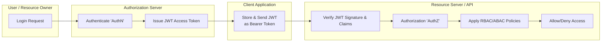

Got it 👍 Let’s break this down clearly:

---

## 🔐 **AuthN vs AuthZ**

* **Authentication (AuthN)** → *Who are you?*
  Verifies **identity** (e.g., login with username/password, SSO, biometric).
* **Authorization (AuthZ)** → *What can you do?*
  Determines **permissions & access** once identity is confirmed.

---

## ⚙️ **OAuth2**

* A **delegated authorization** framework.
* Instead of giving your password to an app, you grant it a **token** to access certain resources.
* Roles in OAuth2:

  * **Resource Owner** → The user
  * **Client** → App requesting access
  * **Authorization Server** → Issues tokens
  * **Resource Server** → Hosts protected APIs/data

➡️ Example: "Login with Google" → Google issues an **access token** that app uses to fetch your data.

---

## 🔑 **JWT (JSON Web Token)**

* A compact, stateless token format often used in OAuth2 and other systems.
* Structure:

  ```
  header.payload.signature
  ```

  * **Header** → Algorithm & token type
  * **Payload** → Claims (user ID, roles, expiry, etc.)
  * **Signature** → Validates integrity (prevents tampering)
* Benefits:

  * Self-contained (no DB lookup needed)
  * Used in **Bearer tokens** for APIs
* Risks:

  * Can’t be revoked easily unless paired with server-side tracking/blacklist.

---

## 👥 **Authorization Models**

### 1. **RBAC (Role-Based Access Control)**

* Users are assigned **roles** (e.g., Admin, Editor, Viewer).
* Roles determine **permissions**.
* Easy to manage for organizations, but coarse-grained.

➡️ Example:

* Admin → can read/write/delete
* Editor → can read/write
* Viewer → can read

---

### 2. **ABAC (Attribute-Based Access Control)**

* Uses **attributes** (user, resource, context, environment) to decide.
* More **fine-grained & dynamic** than RBAC.
* Policies are written as rules.

➡️ Example:

* "Allow access if user.department = 'Finance' AND resource.classification = 'Internal' AND access\_time < 6 PM"

---

## 🔄 How They Work Together

* **AuthN**: User signs in (e.g., via OAuth2, SAML, password).
* **Token Issuance**: Auth server issues **JWT** with claims.
* **AuthZ**: Resource server enforces access using **RBAC/ABAC** policies based on claims.

---

👉 Would you like me to also draw a **mermaid diagram** (flowchart) showing how OAuth2 + JWT + RBAC/ABAC + AuthN/AuthZ fit together in a real system?

Perfect 👍 Here’s a **Mermaid flowchart** that you can drop directly into your `README.md` (it will render on GitHub/GitLab):



---

### 🔎 What this shows

1. **User logs in** → Authentication happens at the **Auth Server**.
2. **JWT issued** → Contains identity + claims.
3. **Client app** → Stores and forwards the token on API calls.
4. **Resource server** → Verifies token & applies **RBAC/ABAC** rules to enforce **Authorization**.

---
