Let’s break down **Rate Limiting** and **Throttling** — two concepts that often get confused but are widely used in APIs, networking, and distributed systems.

---

## 🔹 **Rate Limiting**

**Definition**:
Rate limiting is about setting a **maximum number of requests or operations allowed within a given time window**. Once the limit is hit, additional requests are **rejected (usually with HTTP 429: Too Many Requests)** until the time window resets.

👉 It’s like a **traffic policeman** stopping cars from entering a busy road once the daily quota is full.

**Use cases**:

* Protect APIs from abuse (e.g., 100 requests per minute per user).
* Prevent DDoS attacks.
* Ensure fair usage across multiple clients.

**Example**:

* A free API tier allows **60 requests per minute**.
* If you send the 61st request before a minute passes, it’s blocked or rejected.

---

## 🔹 **Throttling**

**Definition**:
Throttling **slows down** the rate of requests rather than outright rejecting them. It ensures that requests don’t overwhelm the system by spacing them out.

👉 It’s like a **traffic light**—cars are still allowed, but at a controlled pace.

**Use cases**:

* Smooth system load by **queuing or delaying** excess requests.
* Avoid system overload during traffic spikes.
* Provide Quality of Service (QoS) by prioritizing certain clients.

**Example**:

* An API throttles requests to **10 per second**.
* If you send 20 requests at once, the system accepts them but queues the extra 10 and processes them gradually at 10 per second.

---

## 🔹 Key Difference

| Aspect          | Rate Limiting 🚫               | Throttling ⏳                        |
| --------------- | ------------------------------ | ----------------------------------- |
| Behavior        | Rejects excess requests        | Delays or queues excess requests    |
| Goal            | Prevent abuse & enforce quotas | Smooth out spikes & protect backend |
| User Experience | Requests may fail with 429     | Requests succeed but slower         |
| Example         | “Max 100 requests per minute”  | “Only 10 requests per second”       |

---

✅ **Analogy**:

* **Rate limiting** = "You can only drink 2 coffees per day." (Any more is refused).
* **Throttling** = "You can drink coffee, but only sip one cup every 2 hours." (Slowed down).

---

Perfect 👍 Here’s a **left-to-right Mermaid diagram** that shows the difference between **Rate Limiting** and **Throttling** in a request flow.

```mermaid
flowchart LR
    A[Client Requests] --> B{Rate Limiter}
    
    %% Rate Limiting Path
    B -->|Within Limit| C[Backend Service]
    B -->|Exceeds Limit| D[Reject ❌ 429 Error]
    
    %% Throttling Path
    A --> E{Throttler}
    E -->|Allowed Rate| C
    E -->|Too Fast| F[Queue/Delay ⏳] --> C
```



---

### 📝 Explanation

* **Rate Limiter**:

  * If request is within quota → goes to backend.
  * If quota exceeded → rejected immediately (HTTP 429).

* **Throttler**:

  * If request is within allowed speed → goes to backend.
  * If too many at once → queued or delayed, then sent gradually.

---

Perfect! Let’s look at **real-world NGINX examples** for **Rate Limiting** and **Throttling** (NGINX handles both with the `limit_req` and `limit_req_zone` directives).

---

## **1️⃣ Rate Limiting in NGINX**

**Goal**: Reject requests exceeding a quota.

```nginx
http {
    # Define a shared memory zone to track clients
    # $binary_remote_addr = client IP
    limit_req_zone $binary_remote_addr zone=api_rate_limit:10m rate=5r/s;

    server {
        listen 80;
        server_name api.example.com;

        location /api/ {
            # Apply the rate limit defined above
            limit_req zone=api_rate_limit burst=10 nodelay;

            proxy_pass http://backend_api;
        }
    }
}
```

### 🔹 Explanation:

* `limit_req_zone`: Creates a zone (`api_rate_limit`) to track requests per client IP, **5 requests/sec** allowed.
* `burst=10`: Allows short bursts of up to 10 requests. Anything beyond is **rejected immediately**.
* `nodelay`: Rejects excess immediately instead of delaying.

**Behavior**:

* If a client sends **more than 5 requests/sec + burst of 10**, NGINX responds with **HTTP 503 or 429** (configurable).
* Requests within the limit pass through normally.

---

## **2️⃣ Throttling in NGINX**

**Goal**: Slow down excessive requests instead of rejecting.

```nginx
http {
    limit_req_zone $binary_remote_addr zone=api_throttle:10m rate=5r/s;

    server {
        listen 80;
        server_name api.example.com;

        location /api/ {
            # Throttle excessive requests instead of rejecting
            limit_req zone=api_throttle burst=10 delay=5;

            proxy_pass http://backend_api;
        }
    }
}
```

### 🔹 Explanation:

* `burst=10`: Allows short bursts.
* `delay=5`: Queues excessive requests (beyond 5/sec) for up to 5 seconds instead of rejecting.

**Behavior**:

* If client sends 20 requests/sec:

  * First 5 requests/sec are immediate.
  * Next 10 requests are **delayed**.
  * Beyond burst + delay → rejected.

---

### ✅ Summary

| Feature         | Rate Limiting                 | Throttling               |
| --------------- | ----------------------------- | ------------------------ |
| Directive       | `limit_req` with `nodelay`    | `limit_req` with `delay` |
| Excess Requests | Rejected                      | Queued/delayed           |
| Use Case        | Enforce quotas, prevent abuse | Smooth traffic spikes    |

---

Great! Here’s a **Mermaid diagram** showing how **NGINX handles Rate Limiting vs Throttling** for incoming requests:

```mermaid
flowchart LR
    A[Client Requests] --> B{NGINX Rate Limiter / Throttler}

    %% Rate Limiting Path
    B -->|Rate Limiting: Within Limit| C[Forward to Backend ✅]
    B -->|Rate Limiting: Exceeds Limit| D[Reject Request ❌ HTTP 429]

    %% Throttling Path
    B -->|Throttling: Allowed Rate| C
    B -->|Throttling: Too Fast| E[Queue/Delay ⏳] --> C
```



---

### 📝 Explanation:

1. **Rate Limiting**

   * NGINX tracks request rate per client (via `limit_req_zone`).
   * Requests exceeding limit + burst are **rejected immediately** (`nodelay`).

2. **Throttling**

   * Requests exceeding allowed rate are **queued or delayed** (`delay` option).
   * Eventually processed at a controlled rate without overwhelming backend.

---


