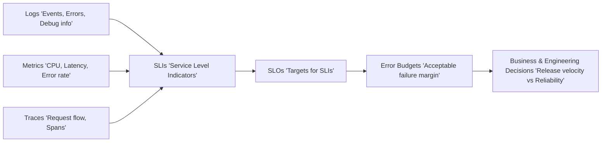
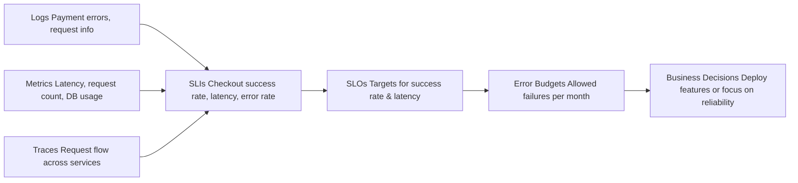

Got it 👍 Let’s break down **Observability** and its core components — **logs, metrics, traces, SLI/SLOs, and error budgets** — in a structured way:

---

## 🔎 What is Observability?

Observability is the ability to understand what’s happening inside a system by examining the data it produces. Instead of just monitoring if something is “up or down,” observability lets you **ask new questions** about system behavior — even ones you didn’t anticipate during design.

It’s usually built on the **three pillars** + **SRE practices**:

---

## 📜 Logs

* **What**: Detailed, timestamped records of events (e.g., “User X logged in,” “DB connection failed”).
* **Use case**: Root cause analysis, debugging unexpected behavior.
* **Challenge**: Can get very noisy and expensive if not managed well.
* **Tools**: ELK stack (Elasticsearch, Logstash, Kibana), Splunk, Fluentd, Loki, CloudWatch Logs.

---

## 📊 Metrics

* **What**: Numeric measurements collected at intervals (e.g., CPU utilization = 70%, requests/sec = 150).
* **Use case**: Performance monitoring, trend analysis, alerting on thresholds.
* **Types**: Counters, gauges, histograms.
* **Tools**: Prometheus, Datadog, New Relic, Cloud Monitoring.

---

## 🔗 Traces

* **What**: Track requests as they flow across distributed systems (microservices, APIs, DBs).
* **Use case**: Identify latency bottlenecks, see where requests fail.
* **Concepts**: Spans (individual operations) and trace IDs (end-to-end request path).
* **Tools**: Jaeger, Zipkin, OpenTelemetry, AWS X-Ray.

---

## 📐 SLIs (Service Level Indicators)

* **What**: Quantitative measures of system behavior from the user’s perspective.
* **Examples**:

  * Latency (e.g., 95% of requests < 300ms)
  * Availability (e.g., 99.9% uptime)
  * Error rate (e.g., <0.1% requests fail)
  * Throughput (e.g., 100 req/sec sustained)

---

## 🎯 SLOs (Service Level Objectives)

* **What**: Target goals for SLIs, defining "good enough" reliability.
* **Example**: *“99.95% of requests must succeed within 250ms over a rolling 30-day period.”*
* Helps balance **reliability vs. velocity** (don’t over-engineer availability at the cost of shipping features).

---

## ⏳ Error Budgets

* **What**: The acceptable margin of failure = 100% – SLO.
* **Example**: If your SLO is 99.9% availability, your error budget = 0.1% downtime/month.
* **Usage**:

  * If error budget is healthy → take risks, deploy features faster.
  * If budget is burned → pause risky releases, focus on reliability.
* Encourages **business + engineering alignment**.

---

## 🧩 Putting it all together

* **Logs** → "What happened?"
* **Metrics** → "What is the system’s health?"
* **Traces** → "Where did the request slow down/fail?"
* **SLIs/SLOs** → "Are we meeting user expectations?"
* **Error budgets** → "How much unreliability can we afford?"

---

Perfect 👍 Here’s a clean **Mermaid left-to-right diagram** that you can drop directly into a `README.md` (it will render in GitHub/GitLab/Markdown previewers that support Mermaid):

---

🔎 **How to read this:**

* **Logs, Metrics, Traces** → raw telemetry sources.
* They are aggregated into **SLIs** → user-focused reliability measurements.
* **SLOs** → define expectations for those SLIs.
* **Error Budgets** → tolerance for failure based on SLOs.
* This flows into **business/engineering decisions** → whether to ship features faster or slow down to improve stability.

---

**practical real-world example**

Great! Let’s make this concrete with a **real-world SaaS API example**:

---

## 🌐 Scenario: E-commerce Checkout API

We’ll track **observability from raw data to business decisions**.

### 1️⃣ Logs

* **What we capture**:

  * `INFO`: User X added item to cart
  * `ERROR`: Payment gateway timeout
  * `DEBUG`: Session ID, request payloads
* **Purpose**: Investigate **why** a checkout failed.

---

### 2️⃣ Metrics

* **Examples**:

  * `request_latency_ms` → histogram of API response times
  * `checkout_success_count` → counter of successful checkouts
  * `checkout_failure_count` → counter of failed checkouts
  * `db_connection_pool_usage` → gauge of DB connections

* **Alerts**:

  * > 95th percentile latency > 500ms
  * Error rate > 0.5%

---

### 3️⃣ Traces

* **Track one checkout request**:

  * Span 1: API gateway received request
  * Span 2: Auth service validated user
  * Span 3: Inventory service checked stock
  * Span 4: Payment service processed transaction
  * Span 5: Response sent to user

* **Purpose**: Pinpoint **slow service** or **failure point**.

---

### 4️⃣ SLIs (Service Level Indicators)

User-focused metrics:

| SLI          | Metric Definition         |
| ------------ | ------------------------- |
| Availability | % of successful checkouts |
| Latency      | % of requests < 300ms     |
| Error rate   | % of failed checkouts     |

---

### 5️⃣ SLOs (Service Level Objectives)

* 99.9% of checkouts succeed per month
* 95% of requests respond within 300ms

---

### 6️⃣ Error Budget

* SLO: 99.9% availability → **Error budget = 0.1% failures**

* Monthly: 0.1% of 1,000,000 checkouts = 1,000 failed checkouts tolerated

* **Usage**:

  * If < 1,000 failures → team can safely deploy new features
  * If > 1,000 failures → pause risky deployments, focus on stability

---

### 7️⃣ Flow Diagram (Mermaid)

---

This shows **exactly how raw telemetry translates into actionable business decisions** in a SaaS environment.

