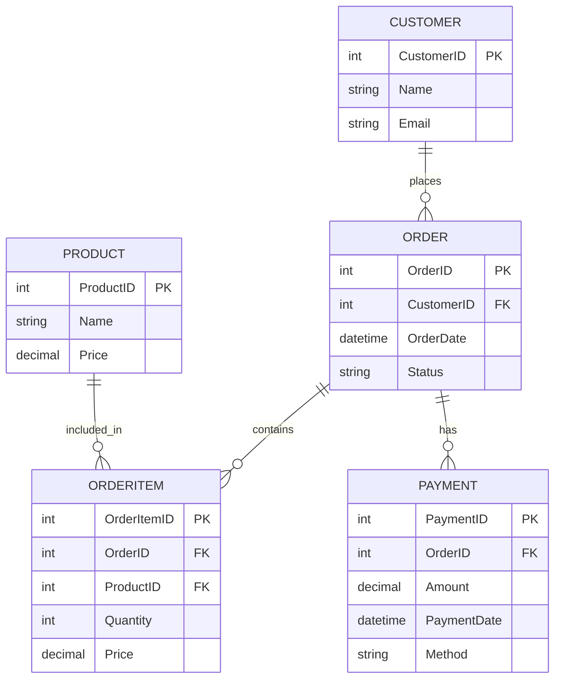

Here’s a structured breakdown of **Data Modeling & Schema Design** — from concepts to real-world practices:

---

## 1. **What is Data Modeling?**

Data modeling is the process of defining how data is structured, stored, and related within a system. It acts as the blueprint for databases, ensuring data consistency, performance, and scalability.

### Goals:

* Represent business requirements in data form.
* Ensure consistency, integrity, and usability.
* Support efficient queries and updates.

---

## 2. **Levels of Data Modeling**

1. **Conceptual Model**

   * High-level, business-oriented.
   * Defines *entities* and *relationships*.
   * Example: *Customer places Order*.

2. **Logical Model**

   * More detail, independent of technology.
   * Defines *attributes*, *keys*, *normalization*.
   * Example: `Customer (CustomerID, Name, Email)`.

3. **Physical Model**

   * Technology-specific (e.g., SQL, NoSQL).
   * Defines tables, indexes, constraints, partitioning, storage.
   * Example (SQL table):

     ```sql
     CREATE TABLE Customers (
       CustomerID INT PRIMARY KEY,
       Name VARCHAR(100),
       Email VARCHAR(100) UNIQUE
     );
     ```

---

## 3. **Schema Design Techniques**

### a) **Normalization**

* Eliminate redundancy and improve integrity.
* Normal forms (1NF → 3NF → BCNF).
* Example: Instead of storing Customer info in every order row, create a separate `Customer` table and link by `CustomerID`.

### b) **Denormalization**

* For read-heavy systems (analytics, OLAP).
* Store redundant or aggregated data for performance.
* Example: Store `OrderTotal` in `Orders` table to avoid recalculating.

### c) **Relational Design (SQL Databases)**

* Tables with PKs, FKs, constraints.
* Use **ER diagrams**.
* Joins to retrieve data.

### d) **NoSQL Schema Design**

* Schema-less but still modeled!
* Optimized for queries rather than strict normalization.
* Patterns:

  * **Embedding** (nested documents in MongoDB).
  * **Referencing** (like foreign keys).
  * **Sharding/Partitioning** (scalability).

---

## 4. **Best Practices**

1. **Understand Access Patterns** – design based on queries, not just entities.
2. **Use Appropriate Keys** – surrogate keys (UUID, AUTO_INCREMENT) vs natural keys (email, SSN).
3. **Plan for Growth** – indexing, partitioning, archiving.
4. **Maintain Integrity** – constraints, validation, cascade rules.
5. **Document the Schema** – ER diagrams, schema migration scripts.

---

## 5. **Real-World Example (E-Commerce)**

Entities:

* **Customer**
* **Product**
* **Order**
* **OrderItem**
* **Payment**

Relational Schema (simplified):

```sql
CREATE TABLE Customers (
  CustomerID BIGINT PRIMARY KEY,
  Name VARCHAR(100),
  Email VARCHAR(100) UNIQUE
);

CREATE TABLE Products (
  ProductID BIGINT PRIMARY KEY,
  Name VARCHAR(100),
  Price DECIMAL(10,2)
);

CREATE TABLE Orders (
  OrderID BIGINT PRIMARY KEY,
  CustomerID BIGINT REFERENCES Customers(CustomerID),
  OrderDate TIMESTAMP,
  Status VARCHAR(20)
);

CREATE TABLE OrderItems (
  OrderItemID BIGINT PRIMARY KEY,
  OrderID BIGINT REFERENCES Orders(OrderID),
  ProductID BIGINT REFERENCES Products(ProductID),
  Quantity INT,
  Price DECIMAL(10,2)
);

CREATE TABLE Payments (
  PaymentID BIGINT PRIMARY KEY,
  OrderID BIGINT REFERENCES Orders(OrderID),
  Amount DECIMAL(10,2),
  PaymentDate TIMESTAMP,
  Method VARCHAR(50)
);
```

This structure:

* Avoids redundancy (products stored once).
* Uses normalization (separate `Order` and `OrderItems`).
* Can be denormalized later for performance (e.g., caching order totals).

---

Got it 👍 You can use **Mermaid** to render the same ER diagram without Graphviz.
Here’s a **left-to-right** ER-style diagram for the e-commerce schema:



---
