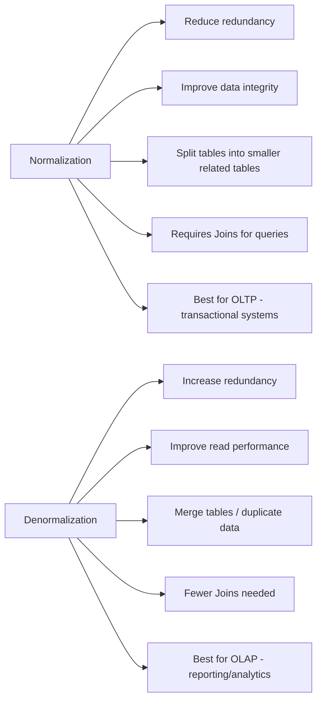

Great question 👍 Let’s break it down clearly:
---

## **Normalization**

* **Definition**: The process of organizing data in a database to reduce redundancy and improve data integrity.
* **Goal**: Avoid duplicate data, ensure consistency.
* **How**: Split large tables into smaller ones and define relationships between them.
* **Pros**:

  * Eliminates data redundancy.
  * Maintains data integrity (changes in one place reflect everywhere).
  * Saves storage space.
* **Cons**:

  * Complex queries (need joins across multiple tables).
  * Can reduce read performance for analytics-heavy workloads.

**Example** (Normalized DB):

```
Customers
----------
CustomerID | Name | Email

Orders
----------
OrderID | CustomerID | OrderDate
```

👉 Customer data is stored once, and orders reference it via `CustomerID`.

---

## **Denormalization**

* **Definition**: The process of combining tables to reduce the need for joins and improve read performance.
* **Goal**: Optimize query speed (especially for reads/analytics).
* **How**: Add redundant data or merge tables.
* **Pros**:

  * Faster queries (fewer joins).
  * Better for read-heavy systems like reporting, OLAP, caching.
* **Cons**:

  * Data redundancy (same info stored multiple times).
  * Risk of inconsistency (need to update data in multiple places).
  * Uses more storage.

**Example** (Denormalized DB):

```
Orders
----------
OrderID | CustomerName | CustomerEmail | OrderDate
```

👉 Customer info is repeated in every order row.

---

## **When to Use**

* **Normalization**:

  * OLTP systems (transactional apps, banking, ecommerce checkout).
  * When data consistency and integrity are critical.

* **Denormalization**:

  * OLAP systems (reporting, analytics, dashboards).
  * When performance (fast reads) is more important than strict consistency.

---

⚖️ **In practice:** Many systems use a *hybrid* approach — normalized for transactional data, denormalized in data warehouses or caching layers for analytics and reporting.

---

Perfect 👌 Here’s a **Mermaid left-to-right diagram** that visually contrasts **Normalization vs Denormalization**:


