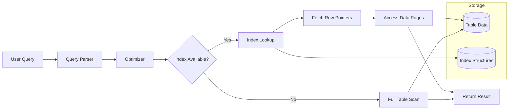

Here’s a structured breakdown of **Indexing in Data Storage & Modeling**:

---

## 🔹 What is Indexing?

Indexing is a data structure technique used to **optimize the speed of data retrieval** operations in a database (or storage system) at the cost of additional storage and overhead during writes (inserts, updates, deletes).
Think of it like the index at the back of a book: instead of scanning every page, you jump directly to the location.

---

## 🔹 Why Indexing?

* **Faster Queries** – reduce scan time (from full table scan to index lookup).
* **Efficient Sorting/Search** – speed up `WHERE`, `JOIN`, `ORDER BY`, `GROUP BY`.
* **Support Uniqueness** – via unique indexes (like enforcing primary keys).
* **Trade-offs** – indexes add overhead:

  * Extra **storage** (indexes can take 20–50% of table size).
  * Slower **writes** (insert/update/delete must also update indexes).

---

## 🔹 Types of Indexing

### 1. **Primary Index**

* Built automatically on the **primary key**.
* Ensures **uniqueness**.
* Clustered by default in many DBs (data is physically ordered).

### 2. **Secondary (Non-clustered) Index**

* User-created on non-primary key columns.
* Helps speed up queries on those columns.
* Data is not physically reordered.

### 3. **Clustered Index**

* The table’s rows are physically stored in the order of the index.
* Only **one clustered index per table**.
* Example: `PRIMARY KEY (customer_id)`.

### 4. **Non-Clustered Index**

* A separate structure with pointers to data rows.
* You can create **multiple per table**.
* Example: indexing `email` in a `users` table.

### 5. **Composite Index**

* Index on **multiple columns**.
* Order matters (`INDEX(col1, col2)` ≠ `INDEX(col2, col1)`).
* Useful for queries filtering on both.

### 6. **Unique Index**

* Guarantees uniqueness (e.g., emails in a `users` table).

### 7. **Full-Text Index**

* Specialized for text search (phrases, ranking, fuzzy matching).

### 8. **Bitmap Index**

* Efficient for **low-cardinality columns** (like gender, status).
* Common in data warehouses.

### 9. **Hash Index**

* Uses a hash table mapping keys → row pointers.
* Very fast for equality lookups (`WHERE id = 123`), but not good for range queries.

---

## 🔹 Indexing in Data Modeling

When designing a schema:

1. **Identify Access Patterns**

   * Which columns are used in `WHERE`, `JOIN`, `GROUP BY`, `ORDER BY`?
   * Build indexes for the **frequent queries**, not every column.

2. **Balance Read vs. Write**

   * OLTP (transactional DBs) → fewer indexes to keep writes fast.
   * OLAP (analytics) → more indexes for complex queries.

3. **Normalize & Index**

   * Primary keys → indexed by default.
   * Foreign keys → usually benefit from indexing.

4. **Avoid Over-Indexing**

   * Too many indexes = write bottlenecks + wasted space.
   * Use **index monitoring** tools (like `pg_stat_user_indexes` in Postgres).

---

## 🔹 Real-World Example

**Table: Orders**

```sql
CREATE TABLE orders (
    order_id     BIGINT PRIMARY KEY,
    customer_id  BIGINT,
    order_date   TIMESTAMP,
    status       VARCHAR(20),
    amount       DECIMAL(10,2)
);
```

Indexes:

```sql
-- Primary index (clustered)
PRIMARY KEY (order_id);

-- For frequent lookups by customer
CREATE INDEX idx_orders_customer_id ON orders(customer_id);

-- For date-based reports
CREATE INDEX idx_orders_date ON orders(order_date);

-- For filtering by status and customer together
CREATE INDEX idx_orders_status_customer ON orders(status, customer_id);
```

✅ Queries like

```sql
SELECT * FROM orders 
WHERE customer_id = 101 
AND status = 'SHIPPED';
```

will use the **composite index** effectively.

---

⚖️ **Summary:**

* Indexing is about **trade-offs between read performance, write overhead, and storage cost**.
* In **data modeling**, think in terms of **access patterns** → design indexes to serve the queries, not the other way around.

---

Here’s a **Mermaid diagram (left-to-right)** that shows how indexing fits into **data storage & query execution flow**:



### 🔹 Flow Explanation:

* Query comes in → parsed & optimized.
* Optimizer decides whether an **index** can be used.
* If yes → index lookup → fetch row pointers → access table pages.
* If not → full table scan.
* Results are returned.

---
